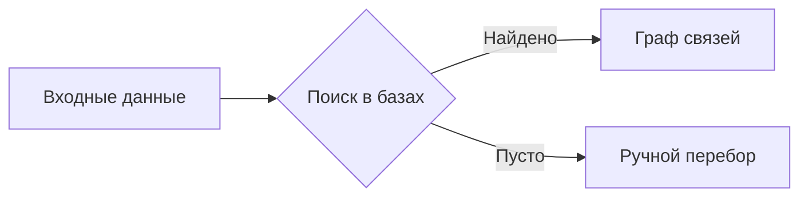

Для анализа связей я использую стандарт **Mermaid JS**. 

### Основные обозначения:
* **Круг (( ))** — Цель (Target).
* **Квадрат [ ]** — Данные (Email, Phone, IP).
* **Ромб { }** — Точка принятия решения или проверка.

### Пример структуры расследования:

